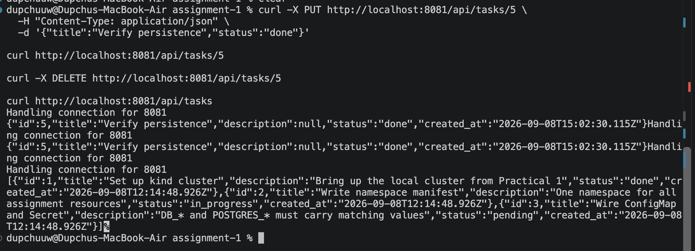
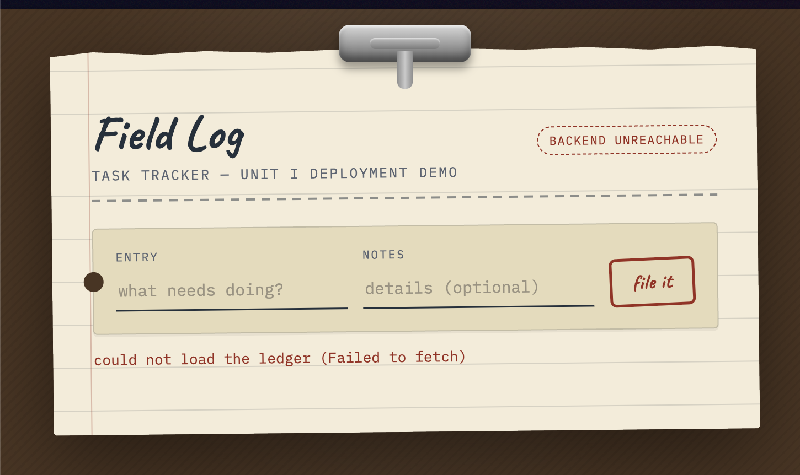
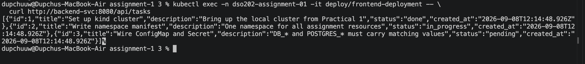
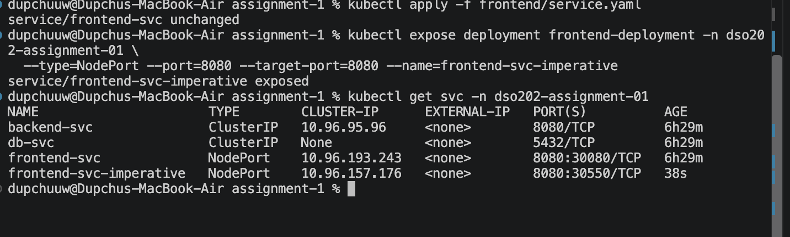
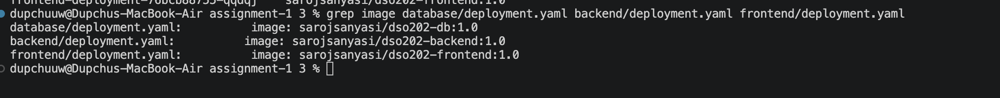

# DSO202 — Assignment 1: Three-Tier Application on Kubernetes

## 1. Architecture Note (Task 1)

**Control-plane and node components involved:**

When `kubectl apply -f` is run against this namespace, the **API server**
validates and persists each manifest to **etcd**. The **scheduler** watches
for the three unscheduled Pods created by the Deployments' ReplicaSets and
binds each to the single kind node available (in a one-node kind cluster,
all three Pods land on the same node). On that node, the **kubelet** pulls
the three images (`dso202-db`, `dso202-backend`, `dso202-frontend`) via the
container runtime, starts the containers, and reports Pod status back to
the API server. **kube-proxy** programs the iptables/IPVS rules on the node
so that the `db-svc`, `backend-svc`, and `frontend-svc` ClusterIPs (and the
frontend's NodePort) route to the correct Pod IPs. The **ReplicaSet
controller** (part of the controller manager) continuously reconciles each
Deployment's desired replica count against actual Pods — this is what
recreates the backend Pod in Task 7c after it is deleted manually. Cluster
**DNS (CoreDNS)** resolves Service names (e.g. `backend-svc`,
`db-svc`) to their ClusterIPs from inside any Pod in the namespace.

**Objects used per tier, and why:**

| Tier | Objects | Why |
|---|---|---|
| Database | Deployment (1 replica), PersistentVolumeClaim, headless Service | Single stateful instance; PVC decouples data from Pod lifecycle (Task 7c); headless Service gives a stable DNS name without load-balancing a single Pod, and is never exposed outside the namespace |
| Backend | Deployment, ClusterIP Service | Stateless API tier; ClusterIP keeps it reachable by name from the frontend and from `kubectl exec` (Task 7b) but unreachable from outside the cluster, satisfying the "must never be exposed via NodePort/LoadBalancer" constraint |
| Frontend | Deployment, NodePort Service | Only tier that needs external reachability from a browser/host, hence NodePort (or `port-forward` as a fallback per Section 4 of the brief) |

All three tiers additionally share a namespace-scoped ConfigMap (non-secret
config) and Secret (credentials), and are jointly bounded by a
ResourceQuota and LimitRange (Task 6).

## 2. Secret Encoding Caveat (Task 2)

The `dso202-secret` Secret stores `DB_USER`, `DB_PASSWORD`, `POSTGRES_USER`,
and `POSTGRES_PASSWORD`. **Kubernetes Secrets are base64-encoded, not
encrypted, at rest by default.** Anyone with `get`/`describe` access to
this Secret in etcd or via the API can trivially decode the values
(`echo <value> | base64 -d`). Encryption at rest requires enabling an
`EncryptionConfiguration` on the API server (out of scope for this
assignment — Unit I). This manifest set is safe for a local kind cluster
used for coursework only; it is not a production secrets-management
pattern.

## 3. ResourceQuota / LimitRange Justification (Task 6)

| Setting | Value | Reasoning |
|---|---|---|
| `pods: 6` | Allows the 3 current Deployment Pods plus headroom for the self-healing test in Task 7c (old Pod terminating + new Pod starting can briefly coexist) and a possible RBAC ServiceAccount object (Task 8, though that consumes no pod quota). |
| `requests.cpu: 750m` / `requests.memory: 512Mi` | Sum of a modest per-Pod request (250m / ~170Mi average) across three lightweight tiers — an nginx static frontend, a small Node.js API, and Postgres — is enough for this Task Tracker's negligible real load, without reserving so much that a single-node kind cluster becomes resource-starved. |
| `limits.cpu: 1500m` / `limits.memory: 1Gi` | Set at 2x requests to give each container burst headroom (e.g. Postgres during initial table/index creation, Node.js during dependency load) while still capping any one runaway container from consuming the whole kind node. |
| LimitRange default request/limit (100m/128Mi requests, 250m/256Mi limits) | Acts as a safety net: matches the per-container assumption above so that a container definition missing explicit resources still gets a sane, quota-compliant default. |

These are teaching-environment values sized for a single kind node, not
production sizing.

## 4. Task 7 — Verification Evidence

### a. Full CRUD cycle

```
$ kubectl port-forward -n dso202-assignment-01 svc/backend-svc 8081:8080 &

$ curl -X POST http://localhost:8081/api/tasks \
  -H "Content-Type: application/json" \
  -d '{"title":"Verify persistence","status":"pending"}'
{"id":5,"title":"Verify persistence","description":null,"status":"pending","created_at":"2026-09-08T15:02:30.115Z"}

$ curl http://localhost:8081/api/tasks
[{"id":1,...,"status":"done",...},
 {"id":2,...,"status":"in_progress",...},
 {"id":3,...,"status":"pending",...},
 {"id":5,"title":"Verify persistence","status":"pending",...}]

# UPDATE — 13 days later, same task, still present
$ curl -X PUT http://localhost:8081/api/tasks/5 \
  -H "Content-Type: application/json" \
  -d '{"title":"Verify persistence","status":"done"}'
{"id":5,"title":"Verify persistence","description":null,"status":"done","created_at":"2026-09-08T15:02:30.115Z"}

$ curl http://localhost:8081/api/tasks/5
{"id":5,"title":"Verify persistence","description":null,"status":"done","created_at":"2026-09-08T15:02:30.115Z"}

# DELETE
$ curl -X DELETE http://localhost:8081/api/tasks/5

$ curl http://localhost:8081/api/tasks
[{"id":1,"title":"Set up kind cluster",...,"status":"done",...},
 {"id":2,"title":"Write namespace manifest",...,"status":"in_progress",...},
 {"id":3,"title":"Wire ConfigMap and Secret",...,"status":"pending",...}]
```



Task 5 was created via POST, confirmed via GET, updated to `status: done`
via PUT (confirmed via a follow-up GET), then removed via DELETE
(confirmed by its absence from the final list). All four CRUD operations
are demonstrated end-to-end against the live backend/database. Note the
PUT was sent with a full object body (`title` + `status`), not a partial
patch — the backend's update handler expects both fields.

**Why curl rather than the frontend UI** : opening the frontend directly in a browser (via the NodePort) shows a "Backend unreachable" / "could not load the ledger (Failed to fetch)" state. This is expected, not a defect: BACKEND_URL is set to http://backend-svc:8080, a cluster-internal DNS name. The frontend's static JS executes in the browser, on the host machine, outside the cluster network — it cannot resolve backend-svc any more than any other program on the host could. Only Pods running inside the cluster (or kubectl exec/port-forward) can resolve or reach that name. This is a direct, correct consequence of the assignment's non-negotiable constraint that the backend must never be exposed via NodePort or LoadBalancer: the backend is intentionally unreachable from a browser outside the cluster. The brief's Task 7a wording ("through the frontend or via curl through a port-forwarded backend") anticipates exactly this, which is why the CRUD cycle above was demonstrated via curl against a port-forwarded backend-svc.



### b. Service DNS resolution

```
$ kubectl exec -n dso202-assignment-01 -it deploy/frontend-deployment -- \
  curl http://backend-svc:8080/api/tasks
[{"id":1,"title":"Set up kind cluster",...},
 {"id":2,"title":"Write namespace manifest",...},
 {"id":3,"title":"Wire ConfigMap and Secret",...}]
```


Executed from inside the **frontend** Pod, this reached the backend Pod
purely by the Service name `backend-svc` — proving cluster DNS (CoreDNS)
correctly resolves in-namespace Service names to their ClusterIP.

### c. Self-healing and data persistence

```
$ kubectl delete pod -n dso202-assignment-01 -l tier=backend
pod "backend-deployment-759f78dc74-587b5" deleted

$ kubectl get pods -n dso202-assignment-01 --watch
NAME                                   READY   STATUS    RESTARTS   AGE
backend-deployment-759f78dc74-j95n4    1/1     Running   0          31s
db-deployment-67f4bb45b6-zx8j7         1/1     Running   0          149m
frontend-deployment-76bcb88755-qqdqj   1/1     Running   0          6h25m
```



```
$ kubectl port-forward -n dso202-assignment-01 svc/backend-svc 8080:8080 &
$ curl http://localhost:8080/api/tasks/5
{"id":5,"title":"Verify persistence","description":null,"status":"pending","created_at":"2026-09-08T15:02:30.115Z"}
```

The backend Pod (`...-587b5`) was deleted manually. The ReplicaSet
controller immediately created a replacement (`...-j95n4`) with a new
Pod name, demonstrating self-healing. Task 5, created *before* the
deletion, was still retrievable from the *new* backend Pod afterward —
demonstrating that Pod lifecycle (backend, stateless, freely
replaceable) and PersistentVolume lifecycle (database, stateful, backed
by `db-pvc`) are independent. The database Pod itself (`...-zx8j7`) was
never touched during this test, isolating the result to backend
self-healing specifically.

**Note on an earlier false start:** during initial setup, a `kubectl
rollout restart` was issued against `db-deployment` (unrelated to this
test — it was used to recover from a transient DNS resolution failure
inside the kind node while pulling images from Docker Hub). A task
created immediately around that restart window was lost, because the
short-lived intermediate Postgres process never durably wrote it to the
PVC before being replaced. This is a known rough edge of kind's default
`local-path` storage provisioner on Docker Desktop for macOS under rapid
pod churn, not a fault in the PVC/Deployment manifests. Once the
database Pod was left running undisturbed (as in the test above), data
written to it persisted correctly across a backend Pod deletion.

### d. Declarative vs. imperative comparison

```
$ kubectl apply -f frontend/service.yaml
service/frontend-svc unchanged

$ kubectl expose deployment frontend-deployment -n dso202-assignment-01 \
  --type=NodePort --port=8080 --target-port=8080 --name=frontend-svc-imperative
service/frontend-svc-imperative exposed

$ kubectl get svc -n dso202-assignment-01
NAME                      TYPE        CLUSTER-IP      EXTERNAL-IP   PORT(S)          AGE
backend-svc               ClusterIP   10.96.95.96     <none>        8080/TCP         6h29m
db-svc                    ClusterIP   None            <none>        5432/TCP         6h29m
frontend-svc              NodePort    10.96.193.243   <none>        8080:30080/TCP   6h29m
frontend-svc-imperative   NodePort    10.96.157.176   <none>        8080:30550/TCP   38s
```

**Comparison:** the declarative approach (`apply -f`) reported
`unchanged` because it diffs the manifest against the Service's stored
desired state and found no drift — this is idempotency in action, and
it's why the rest of this assignment's objects are all managed this way
(reproducible from version control, safe to re-run). The imperative
command (`kubectl expose`) created a brand-new Service on the spot with
an auto-assigned NodePort (30550) and no YAML file behind it anywhere;
it's faster for a one-off exploratory change, but if the cluster were
torn down, recreating `frontend-svc-imperative` means remembering the
exact flags used rather than just re-running `kubectl apply -f`.

## 5. Image Tags

Confirmed working tag: 1.0, used consistently across all three Deployments (sarojsanyasi/dso202-db:1.0, dso202-backend:1.0, dso202-frontend:1.0). Verified by successful image pulls and kubectl get pods -o jsonpath=... showing this exact tag running on the live cluster. latest is not used anywhere, per the assignment's non-negotiable constraints.



## 6. Apply Order

```bash
kubectl apply -f namespace.yaml
kubectl apply -f configmap.yaml
kubectl apply -f secret.yaml
kubectl apply -f quota.yaml
kubectl apply -f database/pvc.yaml
kubectl apply -f database/deployment.yaml
kubectl apply -f database/service.yaml
kubectl apply -f backend/deployment.yaml
kubectl apply -f backend/service.yaml
kubectl apply -f frontend/deployment.yaml
kubectl apply -f frontend/service.yaml
```
