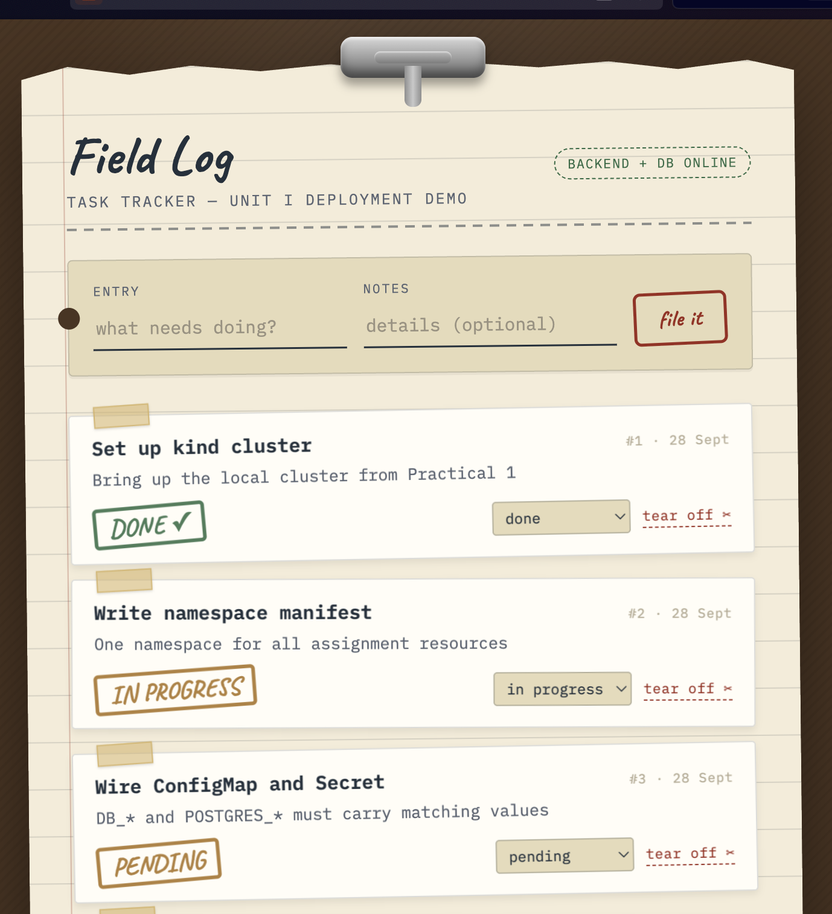
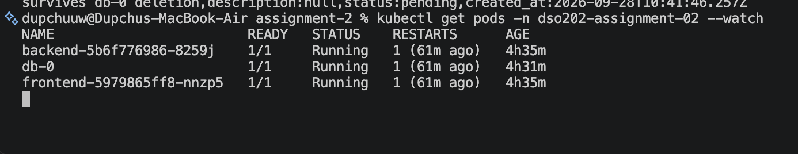
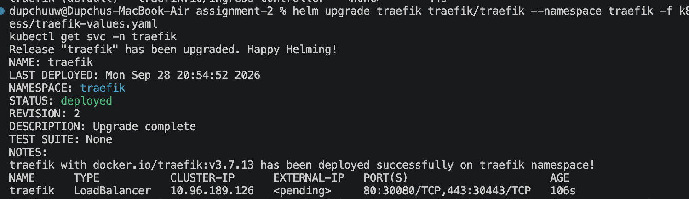

# DSO202 — Assignment 2: Applying Unit II Concepts to the Task Tracker

Continuation of Assignment 1. The application (frontend, backend, database
images and their APIs, schema and environment variables) is **unchanged**;
only the Kubernetes layer is improved using Unit II concepts.

> Status: Stages A (StatefulSet), B (RBAC), C (Ingress) implemented and verified on a live cluster. Operators and Istio still to do. Sections marked
> **TODO** are completed as each stage is implemented and verified.



## 1. Analysis of the existing application

| Component | Technology | State | Port | Configuration |
|---|---|---|---|---|
| Frontend | nginx, static single-page UI | Stateless | 8080 | `BACKEND_URL` rendered into `config.js` at container start |
| Backend | Node.js 22, Express, `pg` | Stateless | 8080 | `DB_*`, `APP_PORT`, `CORS_ORIGIN` |
| Database | PostgreSQL 17 + seed script | **Stateful** | 5432 | `POSTGRES_*`; data in `/var/lib/postgresql/data` |

Findings that drive the design:

1. The frontend's JavaScript runs in the **browser** and calls
   `${BACKEND_URL}/api/...` directly. The frontend Pod never talks to the
   backend Pod. In Assignment 1, `BACKEND_URL` was the cluster-internal name
   `backend-svc`, which a browser outside the cluster cannot resolve — the UI
   showed "Backend unreachable" (Assignment 1, Task 7a note).
2. The only service-to-service call inside the cluster is backend → database (TCP 5432).
3. The application has no authentication and no auth service.
4. No container calls the Kubernetes API.

## 2. Mapping Unit II concepts to this project

| Concept | Applicable? | Where | Why |
|---|---|---|---|
| StatefulSet | Yes | Database only | Only stateful workload; needs stable identity and per-Pod storage. Frontend/backend remain Deployments. |
| Ingress | Yes | `/` → frontend, `/api` → backend | Fixes finding 1: one browser-reachable address routes to both tiers. |
| RBAC | Yes (small) | Per-workload ServiceAccounts; Roles for human users | Pods need no API access, so workload ServiceAccounts get no permissions; the real use is scoping what people can do. |
| Operator | Partly | Existing PostgreSQL operator, demonstration only | A custom operator would be unjustified complexity. **TODO** |
| Istio | Marginal | Demonstration only | One internal hop; limited benefit for three services. **TODO** |

## 3. StatefulSet (database)

Files: `k8s/services/db-svc.yaml`, `k8s/statefulsets/db-statefulset.yaml`

**Why not the Assignment 1 Deployment:** a Deployment gives Pods random names
and its rolling update can briefly run a new Pod alongside the old one against
the same volume. A StatefulSet gives the Pod a stable name (`db-0`), stable
DNS (`db-0.db-svc`), and its own PersistentVolumeClaim created from
`volumeClaimTemplates` (`data-db-0`) that is re-attached whenever `db-0` is
recreated.

**Key settings**

| Setting | Value | Reason |
|---|---|---|
| `serviceName` | `db-svc` (headless, `clusterIP: None`) | Governing Service that provides per-Pod DNS |
| `replicas` | 1 | No replication is configured; extra replicas would be independent, unsynchronised databases |
| `volumeClaimTemplates` | 1Gi, `ReadWriteOnce`, default StorageClass | One PVC per Pod, not shared |
| `updateStrategy` | `RollingUpdate`, `partition: 0` | Default; Pods updated one at a time in reverse ordinal order |
| `persistentVolumeClaimRetentionPolicy` | `Retain` on delete and scale | Deleting or scaling the StatefulSet never deletes data |
| `PGDATA` | `/var/lib/postgresql/data/pgdata` | Data in a subdirectory of the mount avoids initialisation errors on volumes with pre-existing content |

**Application compatibility:** the backend still uses `DB_HOST=db-svc`.
Because `db-svc` is headless it resolves directly to the `db-0` Pod IP, so no
application setting changed.

**Evidence**

Persistence test: a task was created, the database Pod deleted, and the task
was still present afterwards. The seed rows kept their original `created_at`
(`10:34:43`), so the database was not re-initialised.

```
$ curl -X POST http://localhost:8081/api/tasks -H "Content-Type: application/json" \
    -d '{"title":"survives db-0 deletion","status":"pending"}'
{"id":4,"title":"survives db-0 deletion","description":null,"status":"pending","created_at":"2026-09-28T10:41:46.257Z"}

$ kubectl delete pod db-0 -n dso202-assignment-02
pod "db-0" deleted from dso202-assignment-02 namespace

$ kubectl get pods -n dso202-assignment-02 --watch
NAME   READY   STATUS              RESTARTS   AGE
db-0   0/1     ContainerCreating   0          0s
db-0   1/1     Running             0          0s          <- same name

$ curl http://localhost:8081/api/tasks        # task 4 still listed alongside seed tasks 1-3

$ kubectl get pod,pvc -n dso202-assignment-02
pod/db-0                        1/1     Running   0          102s     <- Pod is new
persistentvolumeclaim/data-db-0 Bound  pvc-216af4ae-d101-42e3-9063-573af0f40311  1Gi  RWO  standard  15m   <- volume is not
```




Stable identity and DNS (the Pod IP may change on recreation; the name does not):

```
$ kubectl get pod db-0 -o wide          ->  IP 10.244.0.9
$ kubectl get endpoints db-svc          ->  10.244.0.9:5432
$ nslookup db-0.db-svc.dso202-assignment-02.svc.cluster.local   ->  10.244.0.9
$ nslookup db-svc.dso202-assignment-02.svc.cluster.local        ->  10.244.0.9
```


Note: `nslookup db-0.db-svc` (short name) returned NXDOMAIN from inside the
backend Pod, while the fully-qualified names resolve. This is most likely the
BusyBox resolver in the Alpine-based backend image not applying the cluster
search domains; this was not investigated further.

## 4. Ingress

Files: `k8s/ingress/traefik-values.yaml`, `ingress.yaml`, `ingress-tls.yaml`

**Problem being solved.** The frontend's JavaScript runs in the browser and
calls `${BACKEND_URL}/api/...`. A browser outside the cluster cannot resolve
`backend-svc`, and the assignment forbids exposing the backend through a
NodePort or LoadBalancer. An Ingress gives the browser **one public address**
and routes by path inside the cluster, so the backend stays internal.

**Controller choice.** An Ingress object does nothing without an Ingress
controller. The community `ingress-nginx` controller was retired in March
2026 (no further releases, bug fixes or security patches), so this project
uses **Traefik**, which is maintained and implements the standard
`networking.k8s.io/v1` Ingress API taught in Unit II. Traefik is installed
with Helm in its own `traefik` namespace and exposed as a NodePort service on
30080/30443; `kind-config.yaml` forwards host ports 80/443 to those.

**Routing** (`ingress.yaml`): host `tasks.dso202.local`

| Path | pathType | Backend Service |
|---|---|---|
| `/api` | Prefix | `backend-svc:http` |
| `/` | Prefix | `frontend-svc:http` |

With `Prefix`, the longest matching path wins, so `/api/tasks` reaches the
backend and everything else reaches the frontend. No rewrite is needed.
`ingressClassName: traefik` ties the Ingress to the controller through the
IngressClass object that the Helm chart creates.

**Request path**

```
Browser  http://tasks.dso202.local/api/tasks
  -> /etc/hosts maps the name to 127.0.0.1
  -> host port 80 -> kind node port 30080 (Docker port mapping)
  -> NodePort rule (kube-proxy) -> Traefik Pod in namespace traefik
  -> Traefik matches Host + path /api against the Ingress rules
  -> sends the request to a backend Pod IP (taken from backend-svc's endpoints)
  -> backend Pod -> db-svc -> db-0 (Postgres)
```

The page itself follows the same route with path `/`, ending at the
frontend Pod. `config.js` (rendered from `BACKEND_URL`) tells the browser to
call `http://tasks.dso202.local`, so its API calls are same-origin.

**Evidence**

Traefik installed via Helm (image `traefik:v3.7.13`); IngressClass `traefik`
created as the cluster default. The Ingress routes both paths correctly:

```
$ kubectl get ingress -n dso202-assignment-02
NAME           CLASS     HOSTS                ADDRESS   PORTS   AGE
task-tracker   traefik   tasks.dso202.local             80      0s

$ curl -i http://tasks.dso202.local/api/status
HTTP/1.1 200 OK
Access-Control-Allow-Origin: *
Content-Type: application/json; charset=utf-8
X-Powered-By: Express

{"status":"ok","db":"connected"}

$ curl http://tasks.dso202.local/api/tasks
[{"id":1,...},{"id":2,...},{"id":3,...},{"id":4,"title":"survives db-0 deletion",...}]
```



The `/api/status` response (`db: connected`) confirms the request travelled
browser → Ingress → Traefik → backend-svc → backend Pod → db-svc → db-0, and
`/api/tasks` returned the live task list including task 4 from the StatefulSet
test. In the browser, `http://tasks.dso202.local` loads the UI with the status
badge reading "Backend + DB online" — the same UI that showed "Backend
unreachable" in Assignment 1, now fixed because the browser calls the single
public Ingress address instead of the cluster-internal `backend-svc`.


> Note: the Traefik Service was created as type `LoadBalancer` (the chart
> default) rather than `NodePort`, because the `-f traefik-values.yaml` path
> was not picked up during install. It still works: kind has no cloud load
> balancer, so `EXTERNAL-IP` stays `<pending>`, but the node ports 30080/30443
> are mapped and reachable. To match the intended configuration exactly, run
> `helm upgrade traefik traefik/traefik -n traefik -f k8s/ingress/traefik-values.yaml`
> from the assignment-2 folder (not from inside k8s/).

**Phase 2 (optional): TLS.** A self-signed certificate is created locally and
stored as a `kubernetes.io/tls` Secret named `tasks-tls`; the private key is
never committed. `ingress-tls.yaml` adds the `tls` block, and `BACKEND_URL`
is changed to `https://tasks.dso202.local` so the browser's API calls use
HTTPS too. Browsers warn about a self-signed certificate; that is expected.

## 5. RBAC

Files: `k8s/rbac/serviceaccounts.yaml`, `user-serviceaccounts.yaml`,
`roles.yaml`, `rolebindings.yaml`. All objects are namespaced; no
ClusterRole or ClusterRoleBinding is used because every resource involved
lives in `dso202-assignment-02`, and `cluster-admin` is not used.

| ServiceAccount | Used by | Access | Verbs | Namespace |
|---|---|---|---|---|
| `frontend-sa`, `backend-sa`, `db-sa` | The three workloads | None (no Role bound, token not mounted) | none | n/a |
| `viewer-sa` | A person who only needs to look (e.g. a reviewer) | Pods, logs, Services, endpoints, ConfigMaps, PVCs, events, Deployments, StatefulSets, ReplicaSets, Ingresses | get, list, watch | `dso202-assignment-02` only |
| `deployer-sa` | A person who releases changes | Deployments, StatefulSets, Services, ConfigMaps, Ingresses (full write); Pods (read + delete); PVCs and logs (read only) | see `roles.yaml` | `dso202-assignment-02` only |

Deliberately withheld from both human roles: `secrets` (credentials),
`pods/exec` (a shell in a container can read its environment, including
credentials), and, for `deployer-sa`, deletion of PVCs (which would destroy
database data).

**Evidence** — every result matches the least-privilege design:

```
# viewer-sa
kubectl auth can-i get pods        ... viewer-sa   -> yes
kubectl auth can-i get pods/log    ... viewer-sa   -> yes
kubectl auth can-i get secrets     ... viewer-sa   -> no
kubectl auth can-i delete pods     ... viewer-sa   -> no
kubectl auth can-i get pods -n kube-system ... viewer-sa -> no   (other namespace)
kubectl auth can-i get nodes       ... viewer-sa   -> no   (cluster-scoped)

# deployer-sa
kubectl auth can-i create deployments            ... deployer-sa -> yes
kubectl auth can-i delete pods                   ... deployer-sa -> yes
kubectl auth can-i delete persistentvolumeclaims ... deployer-sa -> no
kubectl auth can-i get secrets                   ... deployer-sa -> no
kubectl auth can-i create pods/exec              ... deployer-sa -> no

# backend-sa (workload identity: no API access at all)
kubectl auth can-i get configmaps  ... backend-sa  -> no
kubectl auth can-i get pods        ... backend-sa  -> no
```


The denial is also visible in a real command, not just `can-i`:

```
$ kubectl get pods -n dso202-assignment-02 --as=system:serviceaccount:dso202-assignment-02:viewer-sa
NAME                        READY   STATUS    RESTARTS        AGE
backend-5b6f776986-8259j    1/1     Running   1 (3m48s ago)   3h37m
db-0                        1/1     Running   1 (3m48s ago)   3h33m
frontend-5979865ff8-nnzp5   1/1     Running   1 (3m48s ago)   3h37m

$ kubectl get secrets -n dso202-assignment-02 --as=system:serviceaccount:dso202-assignment-02:viewer-sa
Error from server (Forbidden): secrets is forbidden: User
"system:serviceaccount:dso202-assignment-02:viewer-sa" cannot list resource
"secrets" in API group "" in the namespace "dso202-assignment-02"
```

`viewer-sa` can see Pods but is refused Secrets, proving the read-only role
never exposes credentials.

## 6. Operators — TODO
## 7. Istio — TODO
## 8. Secret encoding caveat

Kubernetes Secrets are base64-encoded, not encrypted at rest by default
(unchanged from Assignment 1).

## 9. Deployment order and troubleshooting — TODO (finalised after all stages)